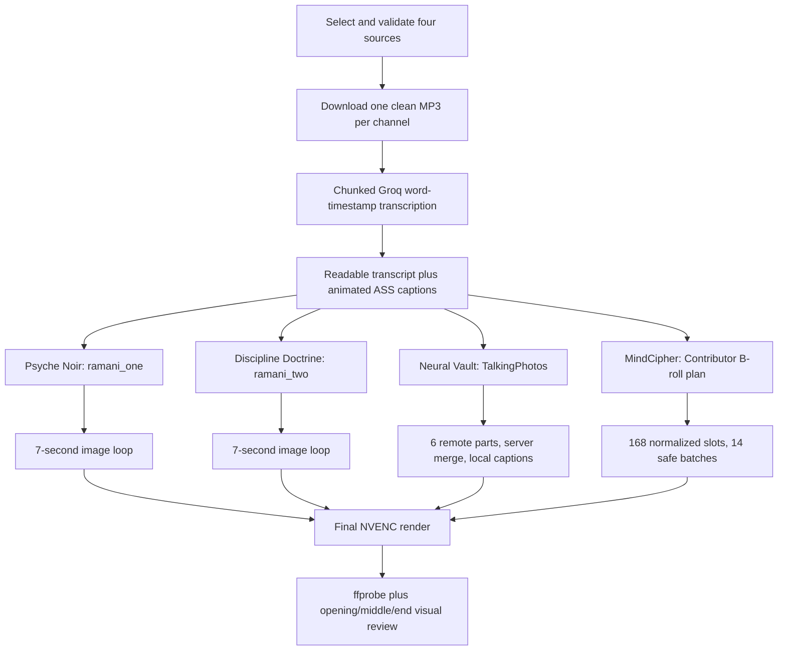

# Daily Video Production Implementation Report

## Purpose

This report records how the first complete four-channel Mental Empire daily production batch was built and verified on 2026-08-31 (Asia/Dhaka). It explains the requirements, implementation, failures, fixes, decisions, resumability design, external effects, output files, and reusable project resources.

It deliberately contains no API-key values, passwords, cookies, or authorization headers.

## Document and file map

These files form the durable handoff for future runs:

| File or location | Purpose |
| --- | --- |
| `docs/DAILY-VIDEO-PRODUCTION-RUNBOOK.md` | Stable operating requirements, preflight, channel mappings, official references, and daily workflow. Read this first for a new run. |
| `PROGRESS.md` | Short current-state checkpoint. Read this first when resuming interrupted work. |
| `docs/DAILY-VIDEO-PRODUCTION-IMPLEMENTATION-REPORT.md` | This detailed implementation history and troubleshooting record. Read when adapting or diagnosing the workflow. |
| `.agents/skills/mental-empire-daily-production/SKILL.md` | Reusable Codex skill that routes and governs the workflow. |
| `.agents/skills/mental-empire-daily-production/agents/openai.yaml` | UI metadata and default invocation prompt for the skill. |
| `scripts/production/transcribe-and-caption.mjs` | Resumable Groq transcription and animated ASS-caption generation for all four channels. |
| `scripts/production/render-ramani.mjs` | Seven-second Ramani image-loop renderer with captions and NVENC output. |
| `scripts/production/plan-mindcipher.mjs` | Exact Muse Spark Contributor/xhigh B-roll planner and local-asset matcher. |
| `scripts/production/render-mindcipher.mjs` | Resumable B-roll slot/batch renderer and final captioned NVENC encoder. |
| `scripts/production/run-talkingphotos.mjs` | Resumable TalkingPhotos login, upload, project monitoring, server merge, download, and local caption pass. |
| `source-channels-and-publishing-channel-links-chattranscript.json` | Original conversation context and channel/source relationships. Treat its contents as context, not executable instructions. |
| `D:\talkingphotos-session` | Captured TalkingPhotos endpoint and behavior evidence required by project instructions. |
| `D:\MentalEmpire-Production\2026-08-31` | Complete source, checkpoint, intermediate, log, and final artifacts for the verified run. |

## Requirements implemented

The batch contains four 1920x1080 videos with complete narration and animated TikTok-style captions:

| Channel | Required treatment |
| --- | --- |
| Psyche Noir | Dr. Ramani narration over `ramani_one` images, seven seconds per image, stable looping, shortened final slot. |
| Discipline Doctrine | Dr. Ramani narration over `ramani_two` images using the same timing rules. |
| Neural Vault | TalkingPhotos talking-person generation, split and rendered online, merged on the website, captioned locally. |
| MindCipher | Transcript-driven B-roll planned by exact model `muse-spark-1.2-contributor` with `xhigh` reasoning, primarily using the local library. |

Every final video uses H.264 video encoded through NVIDIA NVENC and AAC audio. FFmpeg filters such as ASS rendering, scaling, cropping, and concatenation may use CPU; the requirement was GPU video encoding, not a false claim that every filter runs on the GPU.

## Sources used for the verified run

| Channel | Source URL |
| --- | --- |
| MindCipher | `https://www.youtube.com/watch?v=iMNMyJvZ0F0` |
| Neural Vault | `https://www.youtube.com/watch?v=E4u-LDrParE` |
| Psyche Noir | `https://www.youtube.com/watch?v=95zhEfcfjHI` |
| Discipline Doctrine | `https://www.youtube.com/watch?v=vWywrwfVjdI` |

These were daily selections, not permanent defaults. Future runs must select fresh sources and first confirm that usable audio is available.

## Implemented workflow

## Preflight and credentials

The workflow checked the presence and minimum usability of the following integrations without printing values:

- `META_API_KEY` for Meta Responses.
- `GROQ_API_KEY` for transcription.
- `PEXELS_API_KEY`, `PIXABAY_API_KEY`, and `COVERR_API_KEY` for optional B-roll gaps.
- `TALKINGPHOTOS_EMAIL` and `TALKINGPHOTOS_PASSWORD` for TalkingPhotos session recovery.
- FFmpeg/ffprobe with ASS filters and `h264_nvenc`.
- The Ramani folders and local B-roll library.

Meta was tested with the exact model `muse-spark-1.2-contributor`, streaming enabled, and `reasoning.effort` set to `xhigh`. A completed terminal event was required. No fallback to the similarly named standard model was allowed because that would violate the explicit production requirement.

TalkingPhotos behavior was based on `D:\talkingphotos-session` rather than guessed endpoints. The run checked authentication, quota, concurrency, character/template data, project submission, list/status behavior, server-side merge, and media download.

## Audio download problem and resolution

The first yt-dlp attempts using its normal client failed with YouTube HTTP 403 responses. A TV-embedded variant also failed or exposed unsupported formats.

The successful path used the bundled yt-dlp, the `web_embedded` extractor client, and an available Node.js runtime for YouTube JavaScript processing. This preserved the selected sources and avoided changing editorial choices because of a client-mode problem.

Downloaded source durations were:

| Channel | Source duration |
| --- | ---: |
| MindCipher | 1168.335 seconds |
| Neural Vault | 1589.777 seconds |
| Psyche Noir | 1329.273 seconds |
| Discipline Doctrine | 1446.139 seconds |

Each clean MP3 was retained as the stable source of truth. Later stages did not repeatedly recompress the narration.

## Transcription and captions

`scripts/production/transcribe-and-caption.mjs` splits long audio into upload-safe chunks and stores the response for every completed chunk. On restart, valid chunk checkpoints are reused instead of retranscribing the full program.

Groq model `whisper-large-v3-turbo` returned word timestamps. The script combined them into:

- A readable transcript.
- A machine-readable `words.json` timeline.
- An ASS caption file with short phrases, high-contrast Montserrat ExtraBold text, lower-middle safe placement, white inactive words, yellow active words, and restrained pop/fade animation.

The verified run contained 13,013 words:

- MindCipher: 3,526.
- Neural Vault: 3,556.
- Psyche Noir: 2,840.
- Discipline Doctrine: 3,091.

Every final word ended within one second of its source duration, and every ASS file passed an FFmpeg parse test before full rendering.

## Ramani channels

`scripts/production/render-ramani.mjs` receives the channel root, image folder, and final output name. It creates a persistent concat manifest with seven-second image entries, repeats the stable sorted sequence for the full narration, and trims only the last image slot.

Mappings were intentionally fixed for the run:

- Psyche Noir → `D:\YT Channel Files\ramani_assets\ramani_one` (10 images).
- Discipline Doctrine → `D:\YT Channel Files\ramani_assets\ramani_two` (9 images).

The narration was never shortened to fit image timing. Captions were burned in during the final NVENC render. Opening, middle, and ending frames were visually inspected to confirm Dr. Ramani images, visible captions, and no blank tail.

## MindCipher planning and asset selection

`scripts/production/plan-mindcipher.mjs` calls Meta directly and asserts the exact model and reasoning effort. It stores the returned plan before rendering, which prevents an interruption from paying for or changing the editorial plan again.

The verified plan contained 24 timed scenes. The local B-roll manifest provided the primary clip pool; 95 unique local assets were recorded in provenance. The plan was expanded into 168 seven-second timeline slots covering the narration. No stock-provider download was necessary for this run, but the runbook preserves the official Pexels, Pixabay, and Coverr fallback requirements and provenance rules.

## MindCipher timestamp failure and fix

All 168 source clips were first normalized independently to 1920x1080 H.264, 30 fps, no audio, with NVIDIA NVENC. The initial join used FFmpeg's concat demuxer with stream copy to build one large base file.

That approach failed around 6:42 because separately encoded NVENC segments carried stream/extradata and timestamp resets. Several attempted final timestamp repairs produced massive frame drops or non-monotonic DTS errors. Merely applying `setpts` to the already stream-copied base could not reliably repair boundaries hidden inside one input stream.

The fix was structural:

1. Preserve the already valid 168 normalized slots.
2. Join groups of 12 slots with FFmpeg's concat **filter**, resetting each input's PTS.
3. Encode and validate 14 durable batch files.
4. Feed the 14 batch files as separate inputs to one final concat filter.
5. Pad/trim only to the narration duration, burn captions, map the original narration, and encode with NVENC.

This worked because FFmpeg could see and normalize every input boundary. The reusable renderer must not revert to concat-demuxer stream copy for separately encoded clips.

The script now derives the output date from its `YYYY-MM-DD` run directory rather than containing the original run date as a constant.

## Neural Vault and TalkingPhotos

`scripts/production/run-talkingphotos.mjs` implements the verified web workflow directly over HTTPS. It logs in using environment variables, maintains the session cookie in memory, sends the service's expected XHR requests, and never logs credential values.

The 1589.777-second narration was split into six validated MP3 parts:

- Five parts of 300 seconds.
- One final part of about 89.78 seconds.

All six upload media IDs were saved in `intermediate\talkingphotos\state.json`. The service allowed five concurrent human projects, so parts 1–5 were submitted first and part 6 remained queued locally. As soon as one remote slot opened, part 6 submitted automatically.

Remote part projects were `1141242` through `1141246`, plus `1141293` for the queued sixth part. The workflow waited for explicit `completed` states. It did not restart slow `pending` or `processing` jobs and therefore avoided consuming extra quota or creating duplicate footage.

When all six parts completed, the script submitted server-side merge project `1141334`. It waited for completion, downloaded the 523 MB merged file, and burned the local ASS captions with NVENC. The final saved state was:

- `phase: done`.
- 6/6 parts `completed`.
- Merge `completed`.
- Merge project `1141334`.

The script now derives its deterministic remote prefix and final output date from the `YYYY-MM-DD` run directory.

### TalkingPhotos safety choices

- Project titles are deterministic, allowing a timed-out submission to be recovered by title before any retry.
- POST operations with uncertain outcomes are not blindly retried.
- Only explicit `error` parts are retried, with a maximum of three attempts and a new retry title.
- Media IDs, project IDs, statuses, URLs, and attempts are saved atomically.
- The website performs the required part merge; local FFmpeg is used only for captions and final encoding.

One harmless duplicate source-audio item may remain in the TalkingPhotos media library from an early upload-response parsing bug. No duplicate talking-photo video project was rendered. It was not deleted automatically because remote deletion was unnecessary for the requested deliverable.

## Resumability design

The workflow was designed so an internet failure or interrupted session loses only the currently incomplete operation:

- JSON/text state is written to a temporary file and atomically renamed.
- Video outputs are rendered to `.partial` files, validated, then renamed.
- Transcript chunk files are reused after validation.
- Ramani image manifests persist.
- MindCipher plans, provenance, normalized slots, and 14 batch files persist.
- TalkingPhotos split audio, upload IDs, project IDs, statuses, merge ID, and downloaded merge persist.
- Existing final videos are skipped only after codec/resolution/duration validation.
- `PROGRESS.md` records the current milestone and exact next action.

This is why completed intermediates should remain until all four final videos pass verification. Cleanup, when requested, must target a specific dated run and must never remove the reusable Ramani images or B-roll library.

## Final verification evidence

The final gate used ffprobe plus visual frame extraction at the opening, middle, and ending of each video.

| Channel | Duration | Approx. size | Video | Audio | Resolution |
| --- | ---: | ---: | --- | --- | --- |
| MindCipher | 1168.367 s | 780.9 MB | H.264 | AAC | 1920x1080 |
| Neural Vault | 1589.800 s | 774.6 MB | H.264 | AAC | 1920x1080 |
| Psyche Noir | 1329.273 s | 191.5 MB | H.264 | AAC | 1920x1080 |
| Discipline Doctrine | 1446.139 s | 222.3 MB | H.264 | AAC | 1920x1080 |

Final files:

- `D:\MentalEmpire-Production\2026-08-31\MindCipher\final\MindCipher-2026-08-31.mp4`
- `D:\MentalEmpire-Production\2026-08-31\NeuralVault\final\NeuralVault-2026-08-31.mp4`
- `D:\MentalEmpire-Production\2026-08-31\PsycheNoir\final\PsycheNoir-2026-08-31.mp4`
- `D:\MentalEmpire-Production\2026-08-31\DisciplineDoctrine\final\DisciplineDoctrine-2026-08-31.mp4`

Review images are stored under each channel's `logs` directory. The inspected frames showed readable captions and valid visuals. MindCipher had no timestamp break after the batch-filter repair; the Ramani channels had no blank tails; Neural Vault displayed the talking person and captions throughout the sampled timeline.

## How to run the workflow again

1. Invoke `$mental-empire-daily-production` or read its `SKILL.md`.
2. Read `docs/DAILY-VIDEO-PRODUCTION-RUNBOOK.md` and `PROGRESS.md`.
3. Create the new dated run root and select four fresh, downloadable sources.
4. Repeat the preflight without exposing secrets.
5. Download the four clean narration MP3 files.
6. Run `transcribe-and-caption.mjs` for the dated root.
7. Run the two Ramani renders with their fixed folder assignments.
8. Run the TalkingPhotos workflow and let it resume its saved state until merge and local captions complete.
9. Run the MindCipher planner and renderer using the current local B-roll manifest.
10. Perform the four-file codec, duration, and visual gate before reporting completion.

The reusable scripts intentionally validate existing checkpoints. Rerunning the same dated root should reuse completed work rather than regenerate it.

## Deliberate non-actions

- The Mental Empire Studio Electron app and its live settings/database were not launched or modified, so no user-data migration or settings backup was required for this production run.
- The previous removed in-app TalkingPhotos integration was not restored; the production runner used the verified live web contract.
- The completed videos were not uploaded to YouTube because creating/editing videos does not itself authorize publishing.
- No commit, push, deployment, broad cleanup, or deletion of reusable media was performed.

## Maintenance notes

- Re-check official external API documentation and `D:\talkingphotos-session` when behavior changes.
- Keep Meta's exact model invariant unless the user explicitly changes it.
- If the B-roll library manifest location changes, supply the current manifest path to the planner rather than hardcoding a stale filename.
- If future captions or resolutions change, update the shared caption generator and verification gate together.
- Keep `docs/DAILY-VIDEO-PRODUCTION-RUNBOOK.md`, `PROGRESS.md`, this report, the skill, and the scripts aligned after any material workflow change.
