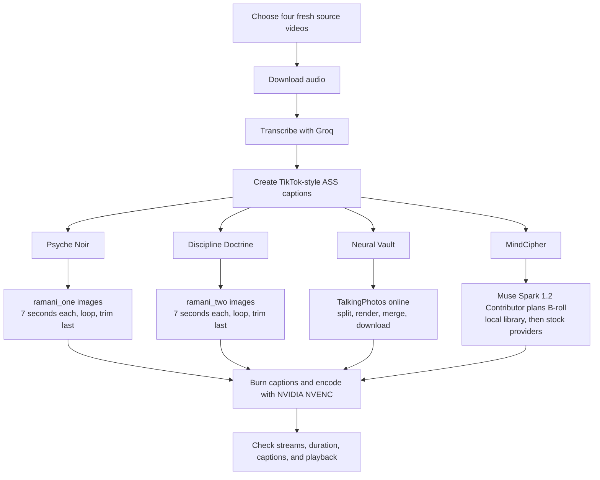

# Daily Video Production Runbook

Last verified: 2026-08-31 (Asia/Dhaka)

## Purpose

This file is the reusable context for producing one video per Mental Empire channel. A new session should read this file first, run the preflight checks, select fresh source videos for that day, and then execute the four channel workflows.

Do not save API-key values, session cookies, or authorization headers in this repository. Read credentials from Windows environment variables at runtime.

## Related project files

- `.agents/skills/mental-empire-daily-production/SKILL.md` — reusable Codex workflow and resumability rules.
- `PROGRESS.md` — concise current milestone and next action for an interrupted run.
- `docs/DAILY-VIDEO-PRODUCTION-IMPLEMENTATION-REPORT.md` — detailed 2026-08-31 implementation history, failures, fixes, rationale, artifacts, and verification.
- `scripts/production/transcribe-and-caption.mjs` — shared transcription and caption stage.
- `scripts/production/render-ramani.mjs` — Psyche Noir and Discipline Doctrine renderer.
- `scripts/production/plan-mindcipher.mjs` and `scripts/production/render-mindcipher.mjs` — MindCipher planning and rendering.
- `scripts/production/run-talkingphotos.mjs` — resumable Neural Vault web generation and local caption rendering.

Read `PROGRESS.md` first when resuming. Read the implementation report only when troubleshooting or changing the workflow.

## Required result

Produce four 16:9 videos per daily run:

| Channel | Visual treatment |
| --- | --- |
| Psyche Noir | Dr. Ramani audio over `ramani_one` still images, with animated captions |
| Discipline Doctrine | Dr. Ramani audio over `ramani_two` still images, with animated captions |
| Neural Vault | TalkingPhotos AI talking-person video, with captions added locally |
| MindCipher | Transcript-driven B-roll edit planned with Meta Muse Spark 1.2 Contributor, with animated captions |

Every final video must contain the complete source audio, visible animated captions, and a GPU-encoded H.264 video stream.

## Workflow map



## Verified requirements

The following checks passed on 2026-08-31. Treat them as a snapshot and repeat the lightweight checks before each production run.

| Requirement | Runtime name or location | Verified state |
| --- | --- | --- |
| Meta planning model | `META_API_KEY`; model `muse-spark-1.2-contributor` | Streaming request with `reasoning.effort: xhigh` returned HTTP 200 and a completed event |
| Groq transcription | `GROQ_API_KEY`; model `whisper-large-v3-turbo` | Authentication and a transcription request succeeded |
| Pexels videos | `PEXELS_API_KEY` | Video search succeeded |
| Pixabay videos | `PIXABAY_API_KEY` | Video search succeeded |
| Coverr videos | `COVERR_API_KEY` | Video search succeeded |
| TalkingPhotos AI | `https://app.talkingphotos.ai` and captured session in `D:\talkingphotos-session` | Authentication succeeded; quota showed 0/100 and concurrency 0/5 |
| NVIDIA GPU | GeForce GTX 1660 Ti, 6 GB | FFmpeg `h264_nvenc` one-second encode succeeded |
| Subtitle support | FFmpeg ASS/subtitles filters plus local caption fonts | Available |
| Psyche Noir images | `D:\YT Channel Files\ramani_assets\ramani_one` | 10 readable 1376x768 images |
| Discipline images | `D:\YT Channel Files\ramani_assets\ramani_two` | 9 readable 1376x768 images |
| Local B-roll | `D:\Mental Empire Studio\broll-library` | 894 videos, about 11.24 GB |
| Disk space | Drive `D:` | About 198 GB free at verification time |

The app already has a Meta backend for Auto B-roll, but its current shared constant is `muse-spark-1.2`. This workflow must call the Meta API directly with the exact model name `muse-spark-1.2-contributor`. Do not silently fall back to `muse-spark-1.2`; if the Contributor model is unavailable, report that branch as blocked.

### Required Meta request contract

Use the Responses endpoint, streaming, and extra-high reasoning. The credential is currently stored as `META_API_KEY` on this Windows machine; it serves the same purpose as `MODEL_API_KEY` in Meta's examples.

```powershell
$body = @'
{
  "model": "muse-spark-1.2-contributor",
  "input": [
    {
      "role": "user",
      "content": [
        { "type": "input_text", "text": "<B-roll planning prompt goes here>" }
      ]
    }
  ],
  "stream": true,
  "temperature": 1,
  "max_output_tokens": 32000,
  "top_p": 1,
  "reasoning": { "effort": "xhigh" }
}
'@

curl.exe -N -X POST "https://api.meta.ai/v1/responses" `
  -H "Authorization: Bearer $env:META_API_KEY" `
  -H "Content-Type: application/json" `
  -H "Accept: text/event-stream" `
  --data-binary $body
```

Before sending, assert that `model` equals `muse-spark-1.2-contributor` exactly and that `reasoning.effort` equals `xhigh`. Parse the server-sent event stream until `response.completed`; treat `response.failed` or a missing terminal event as a failed planning request.

## Preflight for every run

1. Confirm the required environment-variable names exist. Report only present/missing status; never print their values.
2. Send one minimal request to Meta using `muse-spark-1.2-contributor`.
3. Send one minimal search to Pexels, Pixabay, and Coverr.
4. Confirm Groq authentication and that `whisper-large-v3-turbo` is available.
5. Inspect `D:\talkingphotos-session` before using TalkingPhotos. It is the authoritative local record of the current endpoints and behavior; do not guess the API.
6. Check TalkingPhotos quota and concurrency before uploading.
7. Confirm both Ramani image folders are readable and non-empty.
8. Confirm the local B-roll directory is readable.
9. Run a short FFmpeg `h264_nvenc` test and confirm the ASS/subtitles filters are present.
10. Confirm enough free space on `D:` for source audio, intermediate video, and final renders.
11. Use Context7 for current API/library documentation and Firecrawl for official web pages. Accept only first-party or official sources. If one helper cannot access a site, use the other or the normal browser restricted to the official domain.

Stop only the dependent branch when a preflight fails. Continue checking and preparing the independent branches, then report the exact user action needed.

## Daily source selection

Select a fresh, suitable source for each channel on the day of the run. Confirm the video is reachable and has a downloadable audio format before editing. Do not blindly reuse the sample URLs below on later dates.

The four sources selected for the 2026-08-31 run were:

| Channel | Selected source |
| --- | --- |
| MindCipher | [The Psychology of People Who Waste Their Potential](https://www.youtube.com/watch?v=iMNMyJvZ0F0) |
| Neural Vault | [Why Breaking an Empath is the WORST Mistake You Can Make](https://www.youtube.com/watch?v=E4u-LDrParE) |
| Psyche Noir | [Universe Sends These 3 Signs Before Removing a Narcissist From Your Life — Dr. Ramani](https://www.youtube.com/watch?v=95zhEfcfjHI) |
| Discipline Doctrine | [How to RESPOND When a Narcissist Reaches Out After Silence — Dr. Ramani](https://www.youtube.com/watch?v=vWywrwfVjdI) |

All four URLs passed a download simulation when verified.

## Common audio and caption stage

1. Download the best available audio with the bundled or locally available yt-dlp.
2. Preserve a clean source-audio file for recovery; do not repeatedly recompress it between stages.
3. Transcribe through Groq with word timestamps using `whisper-large-v3-turbo`.
4. Keep both a readable transcript and the timestamped machine result.
5. Generate an ASS subtitle file with a TikTok/CapCut-like treatment: short phrases, large high-contrast text, safe lower-middle placement, active-word color emphasis, and restrained pop animation.
6. Check line wrapping and safe margins at 1920x1080 before the full render.

ASS rendering and image/video composition use normal FFmpeg filters and therefore may use some CPU. The final H.264 encoding must use NVIDIA NVENC; “GPU encoding” does not mean every filter is GPU-only.

## Psyche Noir

1. Use `D:\YT Channel Files\ramani_assets\ramani_one`.
2. Sort the images into a stable sequence.
3. Show each image for seven seconds.
4. When the sequence ends before the audio, loop through it again in the same order.
5. Trim the final image segment so the video ends exactly with the audio; never cut the audio to fit an image boundary.
6. Add subtle scale or pan motion only if it does not distract from the captions.
7. Burn in the animated ASS captions and encode the final video with NVENC.

## Discipline Doctrine

1. Use `D:\YT Channel Files\ramani_assets\ramani_two`.
2. Apply the same seven-second image timing, stable looping, final-segment trim, caption, and NVENC rules as Psyche Noir.
3. Never swap the two Ramani folders within the same daily run.

## Neural Vault

1. Use the Neural Vault source audio in TalkingPhotos AI.
2. Follow the current API behavior documented in `D:\talkingphotos-session`.
3. Let TalkingPhotos split the audio into supported parts, upload them, and create a talking-person render for every part.
4. Use an approved saved 16:9 character consistently unless a later brief requests character rotation.
5. Wait for all parts to finish, then use TalkingPhotos' server-side project merge. Do not stitch the parts locally.
6. Download the merged result.
7. Add and burn the ASS captions locally, then produce the NVENC final.

## MindCipher

1. Give the transcript and timing information to Meta using model `muse-spark-1.2-contributor`.
2. Ask for a structured B-roll plan containing start time, end time, visual idea, search query, and rationale. The model plans the edit; it does not invent source licenses or claim a clip exists.
3. Search `D:\Mental Empire Studio\broll-library` first and reuse suitable local footage.
4. Fill genuine gaps from Pexels, Pixabay, and Coverr. Cache downloaded media and record the provider, original page/asset URL, creator when supplied, and required attribution.
5. Do not mass-download provider libraries. Search only for clips needed by the plan.
6. Fit, crop, and trim B-roll to 1920x1080 without stretching it.
7. Preserve the narration as the primary audio, burn the animated ASS captions, and encode with NVENC.

Stock-source notes:

- Pexels requires its API key in the `Authorization` header.
- Pixabay video search uses its videos endpoint and a `key` parameter; cache results for the period required by its documentation.
- Coverr accepts Bearer authentication and requests attribution/linking for API use. Preserve attribution data even when the final publishing description will be prepared later.

## Encoding and verification

Use an FFmpeg build that exposes `h264_nvenc`. Start with the already-tested quality-controlled NVENC configuration and validate a short sample before each full batch. Keep the source frame rate unless there is a reason to normalize it.

For every final file, verify:

- H.264 video and AAC audio streams are present.
- The video duration matches the narration within normal container rounding.
- The opening, middle, and ending play without frozen or missing visuals.
- Captions are visible, synchronized, inside safe margins, and contain no obvious transcription artifacts.
- The Ramani image loop has no blank tail.
- TalkingPhotos part boundaries have no missing audio or duplicate frames.
- MindCipher has no unexplained black gaps and each external clip has provenance recorded.

Suggested run layout:

```text
D:\MentalEmpire-Production\YYYY-MM-DD\
  MindCipher\source audio, transcript, captions, provenance, final
  NeuralVault\source audio, transcript, captions, downloaded merge, final
  PsycheNoir\source audio, transcript, captions, final
  DisciplineDoctrine\source audio, transcript, captions, final
```

Keep intermediates until all four finals pass verification. A later cleanup must name the exact dated run directory and must not delete the reusable image or B-roll libraries.

## Official references

- Meta: [Responses API](https://dev.meta.ai/docs/protocols/responses), [reasoning controls](https://dev.meta.ai/docs/reasoning), and [Muse Spark 1.2 announcement](https://research.meta.ai/blog/multimodal-intelligence-of-muse-spark-1-2)
- Meta API used for live verification: `https://api.meta.ai/v1/models` and `https://api.meta.ai/v1/responses`
- Groq: [Speech-to-text documentation](https://console.groq.com/docs/speech-to-text)
- yt-dlp: [Official project documentation](https://github.com/yt-dlp/yt-dlp)
- Pexels: [Official API documentation](https://www.pexels.com/api/documentation/)
- Pixabay: [Official API documentation](https://pixabay.com/api/docs/)
- Coverr: [Authentication](https://api.coverr.co/docs/auth/) and [API schema](https://api.coverr.co/docs/schema/)
- NVIDIA: [Using FFmpeg with NVIDIA GPU acceleration](https://docs.nvidia.com/video-technologies/video-codec-sdk/13.1/ffmpeg-with-nvidia-gpu/index.html)
- FFmpeg: [Official filter documentation for ASS and subtitles](https://ffmpeg.org/ffmpeg-filters.html)
- TalkingPhotos: [Official application](https://app.talkingphotos.ai); use `D:\talkingphotos-session` for the verified captured API behavior.

## New-session handoff prompt

Use this short instruction in a later session:

> Read `D:\Work\mental-empire-studio\docs\DAILY-VIDEO-PRODUCTION-RUNBOOK.md`, run every non-destructive preflight without exposing secret values, select four fresh source videos for today, and execute the four channel workflows. Report any branch-specific blocker only after completing the remaining independent checks or work.

Or invoke `$mental-empire-daily-production`, which routes to this runbook and the current progress checkpoint.
