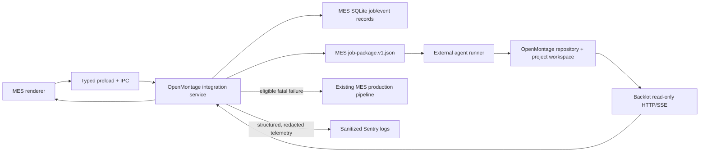
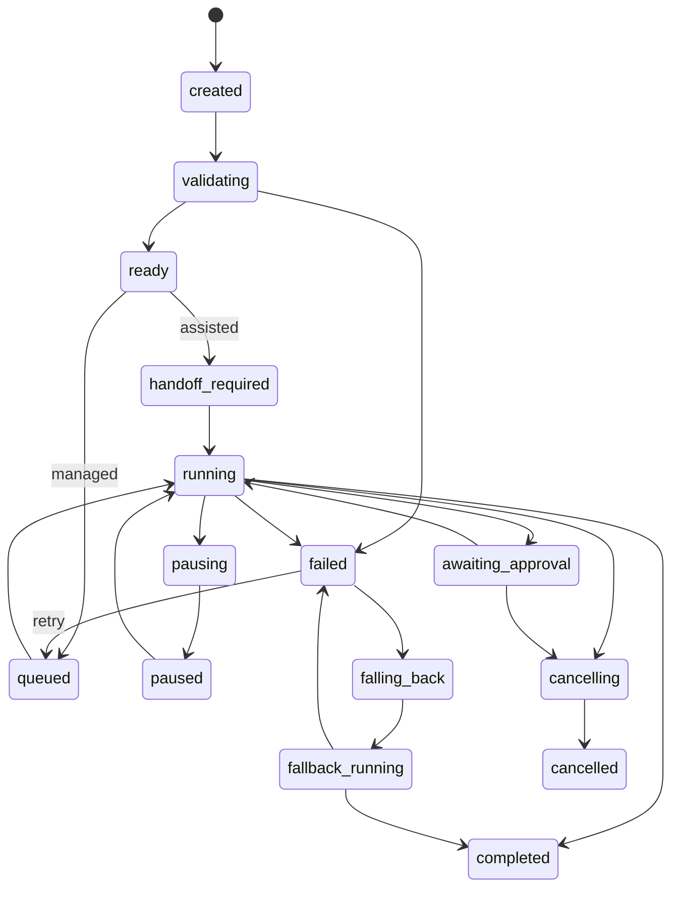

# Mental Empire Studio × OpenMontage Architecture

## Purpose

Mental Empire Studio (MES) integrates with an independently installed OpenMontage repository. MES owns production setup, routing, monitoring, approvals, recovery, and fallback UX. OpenMontage remains the owner of its pipelines, provider registry, project workspaces, checkpoints, artifacts, and composition runtimes.

The integration must remain useful in two environments:

- **Assisted mode:** MES validates a production, creates the handoff package and OpenMontage project workspace, opens the project/Backlot, and gives the operator a runner-ready instruction.
- **Managed mode:** a replaceable external agent-runner adapter consumes the same package, reports structured events, and accepts pause, cancel, resume, approval, and revision commands.

MES does not copy OpenMontage source, import its internal TypeScript/Python types at build time, or silently mutate OpenMontage pipeline definitions.

## System boundary

## Integration surfaces

### MES job package

`shared/openmontage.ts` is the code-first contract. The corresponding public schema is `schemas/job-package.v1.schema.json`.

The package contains project inputs, media locks, requested pipeline/runtime, approval gates, output requirements, and fallback policy. It deliberately contains no provider credentials, tokens, passwords, or runner secrets. Runtime validation rejects secret-shaped keys anywhere in the package.

The contract uses its own version (`mes.openmontage/v1`) instead of pretending OpenMontage exposes a stable library ABI. Adapters translate this stable MES contract into the installed OpenMontage version.

### OpenMontage compatibility probe

OpenMontage currently has no root semantic version contract. MES therefore records the repository Git revision and validates a capability fingerprint:

- required Python modules and checkpoint entry points;
- required pipeline manifests;
- provider registry discovery;
- Backlot health/state/event routes;
- FFmpeg, Remotion, and HyperFrames runtime checks;
- agent-runner availability when managed mode is enabled.

Missing optional capabilities produce `limited`/`degraded`; missing required surfaces produce `incompatible` or `unavailable`.

### Project and checkpoint observation

OpenMontage project workspaces and checkpoint files are canonical. MES persists only integration job state, selected route, sanitized events, checkpoint summaries, output references, and recovery metadata.

Backlot is a read-only observer. MES uses its health, project-state, media, and SSE routes to monitor work. MES never invents mutation endpoints or writes approval results directly into checkpoint JSON. In managed mode, approvals and revision instructions go to the agent runner. In assisted mode, MES creates a copyable continuation instruction for the operator.

### Managed runner protocol

`shared/openmontage-runner.ts` defines `mes.openmontage.runner/v1`, a bounded JSON-lines protocol. The configured runner must prove compatibility during health checks and begin every job with a versioned `hello`. It emits stage, checkpoint, approval, output, activity, completion, failure, and heartbeat events; MES sends acknowledged pause, resume, cancel, approve, and revise commands over stdin.

MES launches the runner without a shell, bounds and redacts stdout/stderr, rejects output paths outside the canonical OpenMontage workspace or configured export root, and persists runner event IDs for deduplication. The runner owns orchestration and provider credentials. On restart, MES reopens the canonical handoff and requests runner recovery without modifying OpenMontage checkpoints.

### Composition runtime selection

Explicit Remotion or HyperFrames choices are honored only when that runtime is available. An unavailable explicit runtime blocks launch and explains why; it is never silently replaced.

For `automatic` composition:

- prefer Remotion for scene-driven footage, captions, and editable composition;
- prefer HyperFrames for kinetic typography / HTML-CSS-GSAP work;
- use the only available editable runtime when appropriate and disclose the choice;
- use FFmpeg only for non-editable output;
- otherwise block OpenMontage launch and let automatic engine routing choose MES.

Documentary Montage currently requires Remotion at compose time. The adapter must treat that pipeline constraint as authoritative even if a general HyperFrames probe succeeds.

## State model

The MES integration job lifecycle is guarded by `canTransitionOpenMontageJob`:

Database writes must use compare-and-set semantics so delayed runner or Backlot events cannot move a terminal job backward. Events carry stable IDs for deduplication.

## Routing and fallback

`decideOpenMontageRoute` is pure and explainable:

- forced MES always selects MES;
- forced OpenMontage preserves that choice but blocks launch when health/capability checks fail;
- Automatic selects OpenMontage only when installation, compatibility, runner mode, and requested runtime are launch-ready;
- every decision returns user-visible reasons and warnings.

Failure classification separates configuration, credentials, provider, runtime, checkpoint, runner, cancellation, and unknown failures. Retry and MES fallback are policy decisions stored with the job. Fallback preserves the OpenMontage project and checkpoint history. Cancellation never triggers fallback.

`OpenMontageProductionService` turns that decision into a tamper-checked production plan. It persists the decision and its user-visible reasons, selects assisted handoff when a configured managed runner is unavailable and assisted fallback is enabled, and revalidates plan evidence before launch. Documentary Montage is blocked unless Remotion is available.

Managed failures are supervised by category. Provider, runtime, and runner failures resume from the canonical handoff up to the configured retry limit. Credentials, configuration, and checkpoint failures skip retries. Once eligible attempts end, `mes-fallback.ts` reuses an originating MES project or creates a normal local Compose project from the narration package. The OpenMontage workspace is never deleted; cancellation and disabled fallback leave the original failure visible.

## Security and credentials

- Provider credentials stay in the OpenMontage environment or external runner environment.
- MES stores only provider/configured/source status, never the value.
- Job packages, SQLite records, IPC payloads, logs, copied recovery prompts, and Sentry events must be credential-free.
- `sanitizeOpenMontageDiagnostic` applies recursively before a diagnostic crosses a boundary.
- Sentry attributes use primitive snake_case fields and include job/project IDs, stage, runtime, attempt, failure category, elapsed time, and fallback outcome.
- Error messages are redacted and truncated. Media content and narration are not attached to Sentry.

## Visual integration

The supplied Figma Make direction and reference screenshots define the screen structure and information hierarchy. Existing MES design tokens, self-hosted fonts, shell, sidebar behavior, focus styles, and compact spacing remain authoritative where the references conflict with the current app. The implementation will use the existing amber action accent and green health signal rather than introducing a second cyan-only design system.

`src/screens/OpenMontage.tsx` is the renderer workspace. It reads health, jobs, events, outputs, Backlot snapshots, and Compose source projects only through `NativeApi`. A seven-step local draft is converted by the pure `src/features/openmontage/model.ts` builder into the same credential-free v1 package accepted by IPC. The renderer never derives a trusted engine decision: it requests a plan, displays its reasons/warnings, and returns that plan to the main-process revalidation path.

Durable job state selects the workspace:

- `running` renders the live stage timeline, scene operation, telemetry, and activity;
- `awaiting_approval` renders storyboard review and sends approve/revise through the managed runner API;
- recovery evidence or a paused transition renders checkpoint/reconnect continuity;
- fallback states render the original failure and independent MES Compose progress together;
- `completed` renders only persisted output references and OS reveal actions;
- `handoff_required` renders assisted prompts, project folder, and Backlot actions.

The browser-only `src/mockApi.ts` implements the same surface with in-memory durable fixtures. It is dynamically loaded only when no Electron preload exists, so screenshots and interaction QA can reach each state without bypassing production contracts or changing the external OpenMontage checkout.

## External reference baseline

- OpenMontage repository: `OpenMontage/` (independent nested Git repository)
- Baseline revision inspected: `0af32ce5e1e830c33992af1f9179dcdcd536549b`
- Current local probe: Python 3.11.9, Node 22.16.0, FFmpeg available, HyperFrames available, Remotion unavailable until its workspace dependencies are installed
- OpenMontage source remains unmodified
